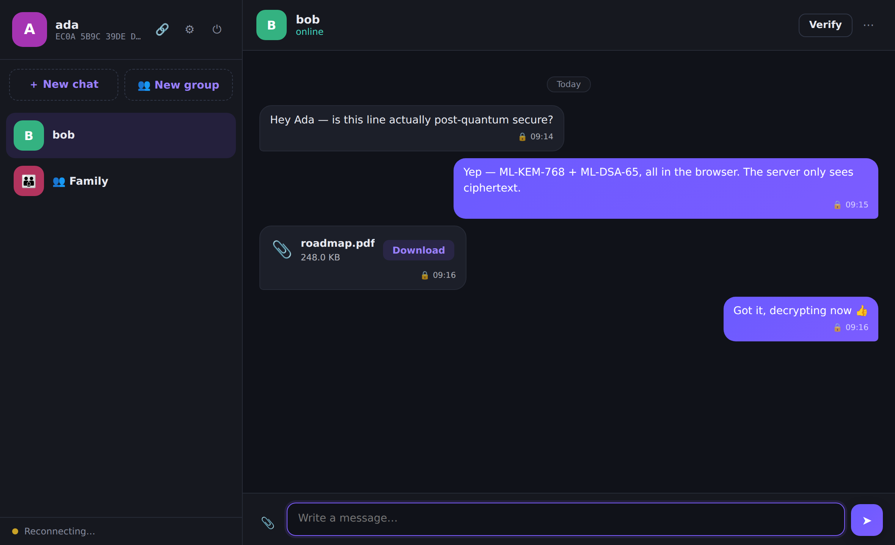
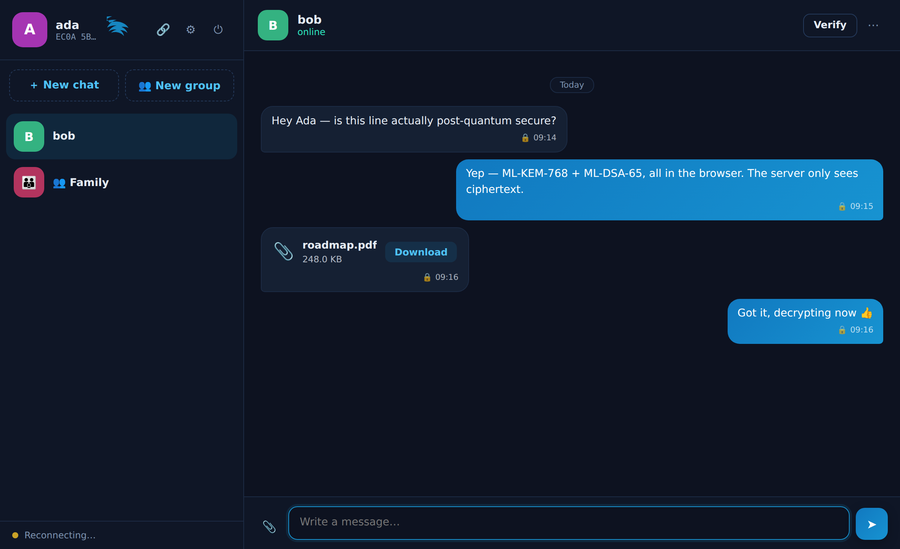
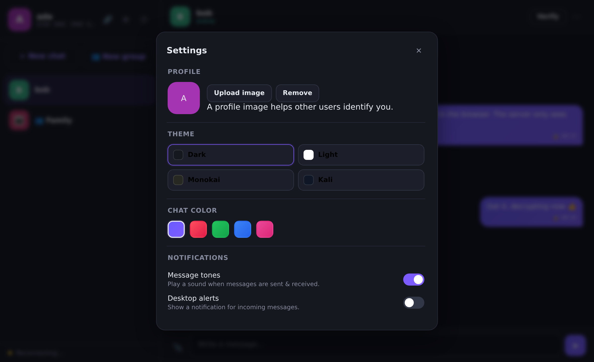
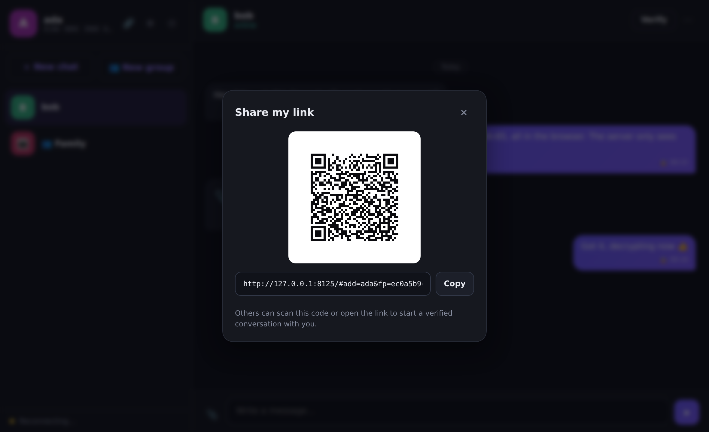

<div align="center">

# Lattix

**Quantum-resistant chat & file sharing.**
End-to-end encrypted messaging built entirely on NIST post-quantum cryptography — with a clean, themeable, single-page UI and one-click installers for Windows, macOS, and Linux.

[](https://github.com/aingram702/Lattix/actions/workflows/build-windows-installer.yml)
[](https://github.com/aingram702/Lattix/actions/workflows/build-linux-installer.yml)
[](https://github.com/aingram702/Lattix/actions/workflows/build-macos-installer.yml)



</div>

Every message and file is encrypted **in your browser** before it ever touches the network. The server is a **zero-knowledge relay**: it stores public keys, opaque ciphertext, and encrypted blobs it cannot read. It can't read your messages, and it can't forge them — recipients verify a post-quantum signature on every message.

> **Repository layout:** the application lives in the [`Lattix/`](Lattix/) subdirectory, which has its own [detailed README](Lattix/README.md). This page is a top-level overview; file paths below are given relative to the repository root.

---

## Cryptography

| Purpose | Algorithm | Standard |
|--------|-----------|----------|
| Key encapsulation (confidentiality) | **ML-KEM-768** (Kyber) | FIPS 203 |
| Digital signatures (authenticity) | **ML-DSA-65** (Dilithium) | FIPS 204 |
| Content encryption | **AES-256-GCM** | FIPS 197 / SP 800-38D |
| Key derivation | **HKDF-SHA-256** | RFC 5869 |
| Vault & encrypted backups | **PBKDF2-SHA-256** (250k iters) + AES-256-GCM | — |

AES-256 remains safe against quantum adversaries — Grover's algorithm only halves its effective strength to 128 bits — so the whole construction is post-quantum secure. The PQC primitives come from the audited [`@noble/post-quantum`](https://github.com/paulmillr/noble-post-quantum) library, vendored as a single offline bundle (`Lattix/client/vendor/lattix-pqc.js`) — **no CDNs, works offline**.

## How a message is protected

Whether it's a 1:1 chat or a group, the same envelope scheme applies:

1. A fresh random 256-bit **Content Encryption Key (CEK)** is generated.
2. The message (or file) is AES-256-GCM encrypted **once** under the CEK.
3. For **each party** — every recipient **and** the sender — an ML-KEM-768 shared secret is established, run through HKDF to a Key-Encryption-Key, and used to AES-GCM-**wrap** the CEK. Groups simply wrap the CEK for every member.
4. The whole envelope (ciphertext + all wrapped keys) is **signed with the sender's ML-DSA-65 key**. The signature is **bound to the conversation** (e.g. the group id), so a signed envelope can't be replayed into a different conversation.
5. The recipient verifies the signature, decapsulates their wrapped key, unwraps the CEK, and decrypts.

Wrapping for the sender too means you can read your own sent history across devices.

---

## Features

**Messaging**
- 🔐 **Post-quantum end-to-end encryption** for every message and file.
- 👨‍👩‍👧 **Group chats** — family or team groups, E2E encrypted (the CEK is wrapped per member). The relay still only ever sees ciphertext.
- 📎 **Encrypted file sharing** — files are encrypted client-side and stored as opaque blobs (up to 50 MB by default).
- ⚡ **Real-time delivery** over WebSocket, with offline message queueing.
- ⏲️ **Disappearing messages** — a Signal-style per-conversation timer (30 s → 1 week); expired messages are purged on both client and server.
- 🔔 **Notification tones & desktop alerts** — WebAudio send/receive tones and optional in-app desktop notifications (no phone number or SMS — privacy-preserving by design).

**Security & privacy**
- ✍️ **Signature verification** on every message — 🔒 marks authenticated messages, ⚠ marks failures.
- 🧾 **Key-fingerprint (safety-code) verification** — compare fingerprints out-of-band to defeat man-in-the-middle / key-substitution attacks.
- 🔗 **QR / link sharing** — a scannable QR code and share URL (offline QR generator, no CDN) that opens a *verified* conversation with you.
- 🚫 **Block users** — locally hide and ignore messages from specific accounts.
- 🗄️ **Encrypted local vault** — your private keys are sealed with your password (PBKDF2 + AES-GCM) and never leave the device.

**Personalization**
- 🎨 **Four themes** — Light, Dark, Monokai, and a dark **Kali Linux** theme with the Kali dragon embedded.
- 🖌️ **Chat colors** — recolor your chat bubbles (red / green / blue / pink).
- 🖼️ **Profile images** — set an avatar so contacts can identify you (downscaled on-device).

**Data & portability**
- 📤 **Export chat history** as machine-readable JSON.
- 💾 **Encrypted backups** — password-sealed (PBKDF2 + AES-GCM) backup files that are useless without your password, plus one-click restore.
- 🧳 **Portable identity** — export/import your encrypted `.vault.json` to move to a new device.
- 🧨 **Delete application data** — one button resets the device (and account) to a fresh install.

**Platforms**
- 🖥️ **Standalone installers** for **Windows, macOS, and Linux** — bundle a Python runtime, no dependencies to install.
- 🧩 **Chrome extension** — the same client ships as an MV3 extension.
- 🌐 **Zero frontend dependencies** — no external CDNs, works offline.

## Screenshots

| Kali theme | Settings | Share / QR |
|------------|----------|------------|
|  |  |  |

---

## Get started

### Install a standalone app

Double-click installers that bundle everything — **no Python needed on the target machine**. Build them locally on the matching OS (from the `Lattix/` project folder), or let CI build them for you (GitHub → **Actions** → the relevant workflow → **Run workflow**, then download the artifact; pushing a `v*` tag attaches installers to a Release).

| Platform | Artifact | How to build (run inside `Lattix/`) |
|----------|----------|--------------|
| **Windows** | `LattixSetup.exe` | `installer\build.bat` (needs [Inno Setup 6](https://jrsoftware.org/isdl.php)) |
| **macOS** | `Lattix-<ver>-<arch>.dmg` | `installer/macos/build.sh` |
| **Linux** | `Lattix-<ver>-<arch>.run` | `installer/linux/build.sh` |

See [`Lattix/installer/README.md`](Lattix/installer/README.md) for details. Launching Lattix starts a local relay on `http://localhost:8000` and opens it in your browser.

### Run from source

Requires **Python 3.10+**.

```bash
git clone https://github.com/aingram702/Lattix.git
cd Lattix/Lattix                   # the app lives in the repo's Lattix/ subfolder

python -m venv .venv
source .venv/bin/activate          # Windows: .venv\Scripts\activate
pip install -r requirements.txt

python run.py                      # opens http://localhost:8000
```

Try it end-to-end by opening the app in **two different browsers** (or one normal + one private window), creating two accounts, and chatting. Each browser holds its own identity vault.

```bash
python run.py --host 0.0.0.0 --port 9000   # expose on your LAN
python run.py --reload                     # dev auto-reload
python run.py --no-browser                 # don't auto-open a browser
```

### Chrome extension

The `Lattix/client/` directory doubles as an unpacked MV3 extension:

1. Run a Lattix relay (`python run.py`, or install a standalone app).
2. Chrome → `chrome://extensions` → enable **Developer mode** → **Load unpacked** → select the `Lattix/client/` folder.
3. Click the Lattix toolbar icon, then open **Settings → Relay server** and point it at your server URL (default `http://localhost:8000`).

All crypto still runs locally; the extension only talks to the relay you configure.

---

## Trust model

Lattix is designed so the **server never needs to be trusted with your content**:

- It **cannot read** messages or files — it only ever sees ciphertext and public keys.
- It **cannot forge** messages — it holds no user's ML-DSA signing key; recipients verify every signature client-side, and signatures are bound to their conversation.
- Account login (the bearer token) only gates *who may push to the relay under a username*. It is deliberately **decoupled** from the E2E keys and is **not** the root of trust for message security.

The one thing a malicious server *could* attempt is a **key-substitution (MITM)** attack — serving you the wrong public key for a contact. Lattix defends against this the same way Signal does: **fingerprint verification**. Open a contact's **Verify** dialog and compare the safety code with what they see on their device (in person, over a call, etc.). If they match, the channel is authentic.

Blocking, disappearing-message timers, and profile images are conveniences layered on top of this core; they don't weaken it.

---

## Project layout

```
Lattix/                            # repository root (this is what you clone)
├── README.md                      # ← this overview
├── .github/workflows/             # CI that builds each OS installer
│   ├── build-windows-installer.yml
│   ├── build-linux-installer.yml
│   └── build-macos-installer.yml
└── Lattix/                        # the application
    ├── run.py                     #   launcher (uvicorn wrapper)
    ├── requirements.txt
    ├── README.md                  #   detailed project README
    ├── server/                    #   zero-knowledge relay (FastAPI)
    │   ├── main.py                #     REST + WebSocket + groups + static hosting
    │   ├── database.py            #     SQLite: users, envelopes, groups, blobs
    │   └── models.py              #     request/response schemas (payloads are opaque)
    ├── client/                    #   single-page app (also the Chrome extension)
    │   ├── index.html
    │   ├── css/styles.css         #     themes: light / dark / monokai / kali
    │   ├── js/                    #     app, crypto, api, config, theme, sound, qr
    │   ├── vendor/lattix-pqc.js   #     bundled, offline post-quantum library
    │   ├── icons/                 #     app + extension icons
    │   ├── manifest.json          #     Chrome extension (MV3) manifest
    │   └── background.js          #     extension service worker
    ├── installer/                 #   standalone installers (all OSes)
    │   ├── lattix_launcher.py     #     frozen entry point (starts relay, opens browser)
    │   ├── lattix.spec            #     PyInstaller build (Win/mac/Linux)
    │   ├── lattix.ico / .icns     #     Windows / macOS icons
    │   ├── lattix.iss, build.ps1  #     Windows: Inno Setup -> LattixSetup.exe
    │   ├── linux/                 #     Linux: self-extracting .run installer
    │   └── macos/                 #     macOS: .dmg disk image
    ├── scripts/
    │   ├── build_vendor.sh        #     rebuild the vendored crypto bundle
    │   └── integration_test.mjs   #     full server + crypto end-to-end test
    ├── docs/screenshots/
    └── data/                      #   SQLite database (created at runtime)
```

---

## Development

All commands run from the `Lattix/` project folder. Run the full end-to-end test suite (point it at a running server):

```bash
# terminal 1
python run.py --no-browser --port 8111
# terminal 2
node scripts/integration_test.mjs        # uses LATTIX_BASE, defaults to :8111
```

It exercises registration, login, the key directory, encrypted messaging, plaintext-leak checks, sender self-decryption, tamper rejection, the encrypted-file round-trip, and live WebSocket delivery — all against the real server using the real client crypto module.

Rebuild the vendored post-quantum bundle (needs Node.js):

```bash
bash scripts/build_vendor.sh
```

---

## Security notes & limitations

- Run behind **HTTPS/WSS** in any real deployment — the account secret is sent to the server at login, and `crypto.subtle` requires a secure context off `localhost`.
- **No forward secrecy / ratcheting yet:** identity keys are long-lived (each message still uses a fresh ephemeral KEM encapsulation, so compromising one message's transcript doesn't reveal others, but compromising a long-term KEM secret key does expose past messages wrapped to it). A Double-Ratchet-style upgrade is the natural next step.
- **Profile images** are stored in the directory so contacts can see them, so they're not part of the zero-knowledge guarantee (everything else — message and file content — is).
- **Blocking** is enforced client-side (as in most E2E apps); a blocked user's server-side ability to send is unchanged, but you never see or get notified of their messages.
- This is a from-scratch application intended as a solid, correct reference — **not a formally audited product**. Get a professional review before trusting it with lives.

---

## License

MIT — see [LICENSE](Lattix/LICENSE).
