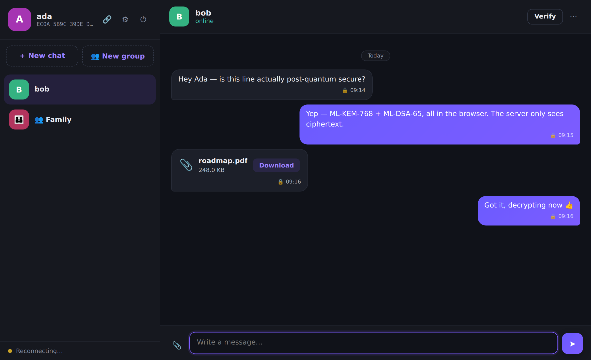
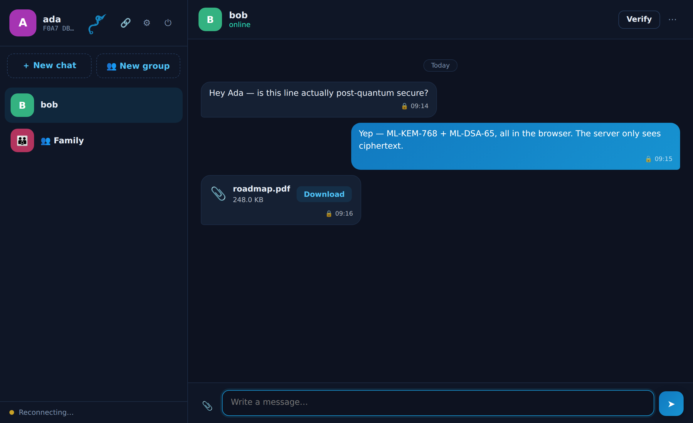
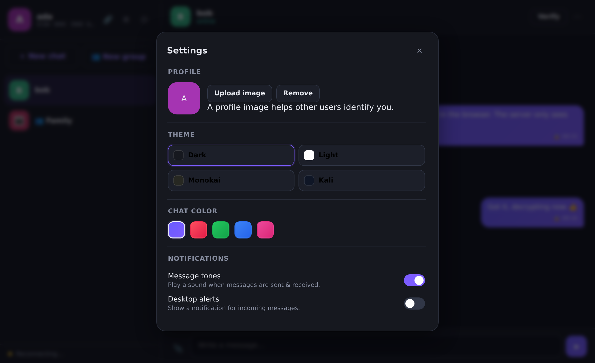
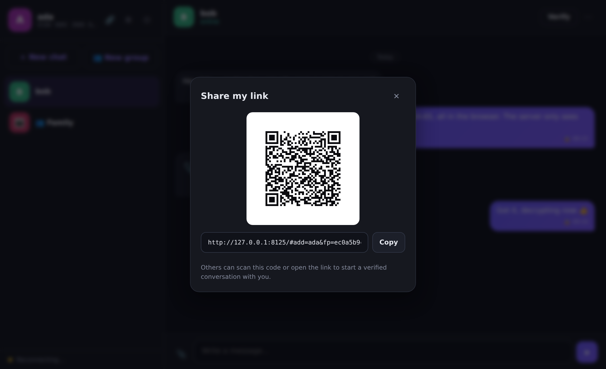

<div align="center">

# Lattix

**Quantum-resistant chat & file sharing.**
End-to-end encrypted messaging built entirely on NIST post-quantum cryptography — a clean, themeable, accessible single-page app, a self-hostable zero-knowledge relay, and one-click installers for Windows, macOS, and Linux.

**Version 2.2.0** · [What's new](#whats-new-in-22) · [Wiki](wiki/Home.md) · [Deploy](DEPLOYMENT.md)

[](https://github.com/aingram702/Lattix/actions/workflows/tests.yml)
[](https://github.com/aingram702/Lattix/actions/workflows/docker-image.yml)
[](https://github.com/aingram702/Lattix/actions/workflows/build-windows-installer.yml)
[](https://github.com/aingram702/Lattix/actions/workflows/build-linux-installer.yml)
[](https://github.com/aingram702/Lattix/actions/workflows/build-macos-installer.yml)



</div>

Every message and file is encrypted **in your browser** before it touches the network. The server is a **zero-knowledge relay**: it stores public keys, opaque ciphertext, and encrypted blobs. It can't read your messages or your files — including their names — and it can't forge them: recipients verify a post-quantum signature on every message and file. Safety codes are computed on your device from the keys actually in use, and pinned, so a relay that swaps keys gets caught.

---

## Table of contents

- [What's new in 2.2](#whats-new-in-22)
- [Cryptography](#cryptography)
- [How a message is protected](#how-a-message-is-protected)
- [Trust model](#trust-model)
- [Features](#features)
- [Screenshots](#screenshots)
- [Get started](#get-started)
- [Host it (reachable from anywhere)](#host-it-reachable-from-anywhere)
- [Configuration reference](#configuration-reference)
- [Project layout](#project-layout)
- [Development](#development)
- [Security notes & limitations](#security-notes--limitations)
- [License](#license)

---

## What's new in 2.2

2.2 is a **security release** that came out of a full code review. Every finding
was reproduced against a live relay before it was fixed, and each one now has a
regression test. The full write-up is in
[`docs/reviews/REVIEW-2.2.0.md`](docs/reviews/REVIEW-2.2.0.md).

**Safety codes you can actually rely on.** Earlier builds displayed the
fingerprint *the relay reported*, not one computed from the keys the client
encrypted to — so a malicious relay could swap a contact's keys and still show
you their correct safety code. Fingerprints are now always computed on-device,
and the first key seen for each contact is **pinned**. If a contact you verified
changes keys, a red banner appears, their new messages show as unverified, and
**sending to them pauses** until you review and accept the new code.

**The QR code is a real verification.** Share links and QR codes have always
carried the owner's fingerprint (`#add=<user>&fp=<code>`); the app used to ignore
it. Opening one now compares it with the relay's keys — a match marks the contact
verified, a mismatch raises a warning and holds sending.

**Files: encrypted names, signed contents.** File names, types and sizes are now
encrypted (the relay stores placeholders), and the sender's signature covers a
hash of the file ciphertext. Previously any recipient of a group file could
substitute different bytes under the sender's valid signature. Files from 2.1.x
still open.

**Stronger vault.** New vaults and backups use PBKDF2-SHA-256 at **600,000**
iterations (was 250,000), with the count recorded in the file. Existing vaults
open as before and are re-sealed at the new strength after your next unlock.

**Relay fixes.** Deleting a group owner's account no longer deletes the group for
everyone (ownership passes to the longest-standing member). Conversations longer
than 500 messages load completely (the client now pages history). Databases from
1.x no longer crash on startup. Deleted accounts' live connections are closed.
Expired disappearing *files* are erased at once rather than hours later. The
directory refuses keys that don't match their fingerprint.

**CI.** The installer and Docker workflows pointed at a `Lattix/` subdirectory
that doesn't exist; they now build from the repository root. A new **Tests**
workflow runs all 15 suites on every push and pull request.

> **Upgrading:** 2.2 relays accept 2.1 clients, and 2.2 clients read 2.1
> history. But files sent from a 2.2 client show as *unverified* in a 2.1
> client, so upgrade the relay (which serves the web client) and the desktop
> apps together. See the [Release notes](wiki/Release-Notes.md).

---

## Cryptography

| Purpose | Algorithm | Standard |
|--------|-----------|----------|
| Key encapsulation (confidentiality) | **ML-KEM-768** | FIPS 203 |
| Digital signatures (authenticity) | **ML-DSA-65** | FIPS 204 |
| Content encryption | **AES-256-GCM** | FIPS 197 / SP 800-38D |
| Key derivation | **HKDF-SHA-256** | RFC 5869 |
| Safety code (fingerprint) | **SHA-256**(KEM public key ‖ DSA public key) | FIPS 180-4 |
| Vault & encrypted backups | **PBKDF2-SHA-256**, 600,000 iterations + AES-256-GCM | SP 800-132 |

AES-256 remains safe against quantum adversaries (Grover's algorithm halves its
effective strength to 128 bits), so the whole construction is post-quantum. The
PQC primitives come from the audited
[`@noble/post-quantum`](https://github.com/paulmillr/noble-post-quantum) library,
vendored as a single offline bundle (`client/vendor/lattix-pqc.js`) — **no CDNs,
works offline**. Details: [wiki/Cryptography](wiki/Cryptography.md).

## How a message is protected

The same envelope scheme covers 1:1 chats, groups, and files:

1. A fresh random 256-bit **Content Encryption Key (CEK)** is generated.
2. The content is AES-256-GCM encrypted **once** under the CEK. For a file, its
   name, type and size are encrypted too, under the same CEK with their own IV.
3. For **each party** — every recipient **and** the sender — an ML-KEM-768
   encapsulation yields a shared secret, HKDF turns it into a key-encryption key,
   and that **wraps** the CEK.
4. The sender **signs** the envelope with ML-DSA-65: the ciphertext (for files, a
   SHA-256 of it), every wrapped key, and a **context** that binds it to its
   conversation, so it can't be replayed into another one.
5. The recipient verifies the signature against the sender's **pinned** key,
   unwraps the CEK, and decrypts — and for files, checks the downloaded bytes
   against the signed hash first.

Wrapping for the sender too means you can read your own sent history on any
device holding your vault.

---

## Trust model

- The relay **cannot read** messages or files — content, file names and types
  are all ciphertext to it.
- It **cannot forge** messages — it holds no ML-DSA signing key, and signatures
  are bound to their conversation.
- It **cannot silently swap keys** for a contact you've verified. Safety codes
  are computed on your device, pinned on first sight, and a change to a verified
  contact's key stops sending until you review it.
- The account login token only gates *who may push to the relay under a
  username*; it is deliberately **not** the root of trust for message security.

**Verify the contacts that matter.** Scan their QR code or open their share
link (which verifies automatically), or compare safety codes in the **Verify**
dialog in person or over a call and click **Codes match — mark as verified**.
Until you do, a contact is trusted on first use, like SSH host keys.

What the relay *does* see: who talks to whom and when, message sizes, avatars,
group names and rosters. See [wiki/Security-and-Trust-Model](wiki/Security-and-Trust-Model.md).

---

## Features

**Messaging**
- 🔐 **Post-quantum end-to-end encryption** for every message and file.
- 👨‍👩‍👧 **Group chats** — the CEK is wrapped per member; owners manage the roster, and ownership passes on if the owner leaves or deletes their account.
- 📎 **Encrypted file sharing** — up to 50 MB by default (relay-configurable). Drag a file onto the conversation or paste an image; oversized files are rejected *before* encryption. Names and types are encrypted.
- 🖼️ **Inline image previews** (PNG, JPEG, GIF, WebP, AVIF up to 8 MB) with a click-to-zoom lightbox — only for files whose signature verified. **On by default**; turn off under **Settings → Media**. SVG is never previewed.
- ⚡ **Real-time delivery** over WebSocket with heartbeat, exponential-backoff reconnect, and a full resync of anything missed.
- 🟢 **Presence** dots, scoped to your contacts.
- ⏲️ **Disappearing messages** — per-conversation timer (30 s → 1 week); expired messages *and their file blobs* are purged on the relay.
- 🔔 **Tones, desktop notifications**, and an unread count in the tab title.

**Security & privacy**
- ✍️ **Signature verification** on every message and file — 🔒 authenticated, ⚠ not.
- 🧾 **Safety codes computed on-device**, pinned per relay, with a mark-as-verified control.
- 🚨 **Key-change banner** — a verified contact's new key pauses sending until reviewed.
- 🔗 **QR / share links that verify** — the embedded code is checked against the relay's keys.
- 🪪 **Self-check** — on sign-in the app confirms the relay is publishing *your* real keys.
- 🗄️ **Encrypted local vault** (PBKDF2 600k + AES-GCM), auto-upgraded from older vaults.
- 🛡️ **Account-creation guards** — confirm password, strength meter, Caps Lock warning, can't-recover acknowledgement, vault-overwrite warning, backup nudge.
- 🚫 **Block users** (client-side).

**The conversation view**
- 🧵 Message grouping, date separators, timestamps, per-sender colours and avatars in groups.
- 🔗 Linkified text (no link previews — they'd leak your IP), Copy / Quote on hover.
- 📜 Windowed rendering with **Load earlier**, **Jump to latest**, and complete history however long.
- ✏️ Per-conversation drafts that survive reloads and failed sends.

**Accessibility & keyboard**
- ⌨️ <kbd>Ctrl</kbd>/<kbd>⌘</kbd>+<kbd>K</kbd> new chat, <kbd>Ctrl</kbd>/<kbd>⌘</kbd>+<kbd>F</kbd> filter, <kbd>/</kbd> message box, <kbd>Esc</kbd> close. Every dialog traps and returns focus.
- 🦮 ARIA roles, labels and live regions; every theme passes an axe-core **WCAG 2.1 A/AA** audit.
- 👁️ Visible focus ring and `prefers-reduced-motion` support. No `confirm()`/`prompt()`.

**Personalization, data & platforms**
- 🎨 Themes: **System**, Dark, Light, Monokai, Kali — applied before first paint. Chat bubble colours.
- 🖼️ Profile images (downscaled on-device).
- 📤 Export chat history as JSON · 💾 encrypted backups · 🧳 portable vault file · 🧨 delete all data.
- 🖥️ Standalone installers (Windows, macOS, Linux) · 🧩 Chrome MV3 extension · 🌐 zero frontend dependencies.

## Screenshots

| Kali theme | Settings | Share / QR |
|------------|----------|------------|
|  |  |  |

---

## Get started

### Install a standalone app

Installers bundle everything — **no Python needed**. Download them from a
[Release](https://github.com/aingram702/Lattix/releases), from the latest run of
the matching workflow under **Actions**, or build locally on that OS:

| Platform | Artifact | Build locally |
|----------|----------|---------------|
| **Windows** | `LattixSetup.exe` | `installer\build.bat` (needs [Inno Setup 6](https://jrsoftware.org/isdl.php)) |
| **macOS** | `Lattix-<ver>-<arch>.dmg` | `installer/macos/build.sh` |
| **Linux** | `Lattix-<ver>-<arch>.run` | `installer/linux/build.sh` |

Launching Lattix starts a local relay on `http://localhost:8000` and opens it in
your browser. Pushing a `v*` tag builds all three and attaches them to a Release.
Details: [`installer/README.md`](installer/README.md).

### Run from source

Requires **Python 3.10+**.

```bash
git clone https://github.com/aingram702/Lattix.git
cd Lattix
python -m venv .venv
source .venv/bin/activate          # Windows: .venv\Scripts\activate
pip install -r requirements.txt
python run.py                      # http://localhost:8000
```

Open it in **two browsers** (or a normal and a private window), create two
accounts, and chat. Each browser holds its own vault.

```bash
python run.py --reload             # dev auto-reload
python run.py --no-browser         # don't open a browser
python run.py --port 9000          # another port
```

> **`--host 0.0.0.0` alone won't let others use it.** Browsers only expose
> `crypto.subtle` in a *secure context* — HTTPS, or `http://` on
> `localhost`/`127.0.0.1`. Over plain `http://` at any other address the page
> loads and explains that it can't run. Serve it over HTTPS
> ([Host it](#host-it-reachable-from-anywhere)) or tunnel to localhost:
> `ssh -N -L 8000:127.0.0.1:8000 user@your-server`.

### Chrome extension

`client/` doubles as an unpacked MV3 extension: `chrome://extensions` →
**Developer mode** → **Load unpacked** → select `client/`. Click the toolbar
icon, then **Change** next to *Relay* on the sign-in screen to point it at your
relay (default `http://localhost:8000`).

---

## Host it (reachable from anywhere)

**[DEPLOYMENT.md](DEPLOYMENT.md)** covers every option:

- **Debian/Ubuntu VPS, one command** — hardened systemd service behind Caddy or
  nginx with Let's Encrypt, plus a read-only `lattix-doctor.sh` diagnostic:
  [`deploy/vps/`](deploy/vps/README.md).
- **Docker Compose** with automatic HTTPS: [`deploy/docker-compose.yml`](deploy/docker-compose.yml).
- **Render**, **Fly.io**, **Railway**, or the published image
  `ghcr.io/aingram702/lattix`.
- A **private relay over Tailscale**: [wiki](wiki/Private-Relay-with-Tailscale.md).

HTTPS is **required**, and the relay runs as a **single process** — sessions,
presence and rate limits are in memory. Don't add `--workers`.

---

## Configuration reference

All relay settings are environment variables. `run.py` flags override them.

| Variable | Default | Purpose |
|---|---|---|
| `LATTIX_DB` | `data/lattix.db` | SQLite database path (also holds encrypted file blobs). |
| `LATTIX_CLIENT_DIR` | `client/` next to `server/` | Web client to serve. If missing, the relay runs API-only and `/` answers 503. |
| `LATTIX_HOST` / `LATTIX_BIND` | `127.0.0.1` | Bind address for `run.py` (`LATTIX_BIND` is the VPS env-file name). |
| `PORT` / `LATTIX_PORT` | `8000` | Port for `run.py` and the container. |
| `LATTIX_FORWARDED_ALLOW_IPS` | `127.0.0.1` | Proxies whose `X-Forwarded-For` is trusted. `*` only when the relay is reachable *solely* through the proxy. |
| `LATTIX_KEEPALIVE` | `75` | Idle keep-alive seconds; must exceed the proxy's upstream keep-alive. |
| `LATTIX_MAX_FILE_MB` | `50` | Upload limit. Keep the proxy's body limit at least this large. |
| `LATTIX_RATE_LIMIT_MAX` | `10` | Register/login attempts per IP per window. `0` disables — **tests only**. |
| `LATTIX_RATE_LIMIT_WINDOW` | `300` | Rate-limit window, seconds. |
| `LATTIX_CORS_ORIGINS` | *(empty)* | Extra comma-separated allowed origins, or `*`. |
| `LATTIX_CORS_ALLOW_LOCAL` | `1` | Allow the desktop apps' `localhost` origin and the Chrome extension. `0` to disable. |
| `LATTIX_DOCS_URL` | `/api/docs` | Interactive API docs. Set to empty to disable in production. |

Fixed limits: session tokens last 12 hours; history pages hold 500 envelopes;
disappearing-message timers run up to 28 days; messages are capped at 2 MB of
JSON; avatars at 400 KB; groups at 256 members. Full detail:
[wiki/Configuration](wiki/Configuration.md).

---

## Project layout

```
Lattix/                          # repository root
├── .github/workflows/           # tests, Docker image, and the three installer builds
├── run.py                       # launcher (uvicorn wrapper with a helpful banner)
├── requirements.txt · Dockerfile · Procfile
├── server/                      # zero-knowledge relay (FastAPI + SQLite)
│   ├── __init__.py              #   __version__ — single source of truth
│   ├── main.py                  #   REST, WebSocket, groups, files, static hosting
│   ├── database.py              #   schema, migrations, storage
│   └── models.py                #   request validation (payloads stay opaque)
├── client/                      # single-page app — also the Chrome extension
│   ├── index.html · css/styles.css · manifest.json · background.js
│   ├── js/app.js                #   UI, conversations, key trust (pinning, banner, verify)
│   ├── js/crypto.js             #   ML-KEM / ML-DSA / AES-GCM, file format v2, vault
│   ├── js/api.js                #   REST + WebSocket client (retries, re-login, resync)
│   ├── js/config.js             #   relay URL setting and validation
│   ├── js/{preload,theme,sound,qr}.js
│   └── vendor/lattix-pqc.js     #   offline post-quantum bundle
├── deploy/                      # Compose + Caddy, Fly, Render, and vps/ (Debian installer, doctor)
├── installer/                   # PyInstaller spec + Windows / macOS / Linux packaging
├── scripts/                     # test suites, test runner, vendor build
├── docs/                        # screenshots, design notes, reviews/
└── wiki/                        # user & operator documentation
```

---

## Development

### Tests

**15 suites.** Three drive the relay directly, one tests the database layer, and
eleven drive the real UI in headless Chromium.

| Suite | Covers |
|---|---|
| `db_test.py` | Migration from 1.x databases, owner succession on account deletion, expired-blob cleanup, history page size. |
| `integration_test.mjs` | Protocol: registration, login, directory, encrypted messaging, plaintext-leak checks, self-decryption, tamper rejection, file round-trip, live delivery. |
| `server_test.mjs` | Relay rules: input validation, file access control, group succession on leave, presence, session invalidation. |
| `regression_test.mjs` | 2.2 fixes: fingerprint/key consistency, registration races, account deletion (groups, sockets, presence), binary WebSocket frames, history paging, file format v2 (encrypted names, substitution and replay resistance, v1 compatibility), vault work factor. |
| `ui_test.mjs` | Rendering, grouping, date separators, scroll anchoring, failed-send recovery. |
| `ui_test_auth.mjs` | Signup guards, strength meter, vault-overwrite warning. |
| `ui_test_sidebar.mjs` | Filter, presence, unread title, reconnect backoff. |
| `ui_test_composer.mjs` | Drag-drop, paste, drafts, send-busy lock. |
| `ui_test_dialogs.mjs` | Dialog controller, encrypted backup/restore. |
| `ui_test_media.mjs` | Encrypted image round-trip, previews, lightbox. |
| `ui_test_theme.mjs` | System theme, anti-flash bootstrap, contrast. |
| `ui_test_a11y.mjs` | axe-core WCAG 2.1 A/AA over every theme, keyboard walkthrough. |
| `ui_test_perf.mjs` | Render batching, render window, expiry sweep. |
| `ui_test_relay.mjs` | Relay switching, cross-origin relays, CORS/cache headers, WS auth, restart + re-login, resync, moving an identity. |
| `ui_test_trust.mjs` | Share-link verification, key-change banner and send gating, mismatch warnings, 500+ message history, encrypted file names, vault upgrade. |

```bash
pip install -r requirements.txt
npm install && npx playwright install chromium
node scripts/run_all_tests.mjs            # or: npm run test:all
```

The runner starts its own relay on a scratch database. To run one suite by hand:

```bash
LATTIX_DB=/tmp/lattix-test.db LATTIX_RATE_LIMIT_MAX=0 python run.py --no-browser --port 8111 &
LATTIX_BASE=http://127.0.0.1:8111 node scripts/regression_test.mjs
```

`LATTIX_RATE_LIMIT_MAX=0` is needed because the suites create dozens of accounts
from one address. Never set it on a public relay. `PW_CHROMIUM=/path/to/chrome`
uses an existing Chromium instead of Playwright's download.

### Rebuilding the vendored crypto bundle

```bash
bash scripts/build_vendor.sh        # needs Node.js; pins @noble/post-quantum
```

More: [wiki/Development-and-Contributing](wiki/Development-and-Contributing.md).

---

## Security notes & limitations

- **HTTPS/WSS is required** for any real deployment.
- **No forward secrecy yet.** Identity keys are long-lived; each message uses a
  fresh KEM encapsulation, but a stolen KEM secret key exposes past messages
  wrapped to it. A ratchet is the planned upgrade.
- **Trust on first use.** Until you verify a contact, their first-seen key is
  trusted. A relay that substitutes keys *before* you ever talk to someone is
  only caught by verifying (QR code, share link, or comparing codes).
- **Metadata is visible to the relay** — who talks to whom and when, message
  sizes, group names and rosters, avatars.
- **Replay within a conversation.** Signatures bind an envelope to its
  conversation, not to a moment, so a hostile relay could re-deliver an old
  message in the same chat. Disappearing-message timers are also set by the
  relay, not signed.
- **Blocking is client-side**, as in most E2E apps.
- A careful reference implementation, **not a formally audited product**. Get a
  professional review before trusting it with lives.

Report vulnerabilities privately via the repository's security advisories.

---

## License

MIT — see [LICENSE](LICENSE).
